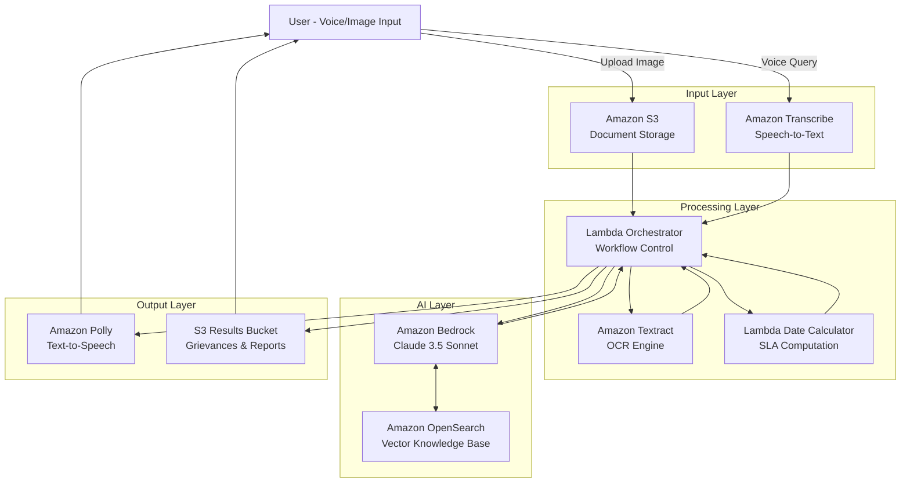

# Design Document: Kisan-Kosh AI Subsidy Watchdog

## Overview

Kisan-Kosh is an event-driven, serverless application built on AWS that provides rural citizens with an intelligent accountability partner for subsidy processing. The system combines OCR, RAG-based knowledge retrieval, and conversational AI to monitor government service delivery, identify eligibility, and assist in grievance generation through a regional-language voice interface.

The architecture follows a microservices pattern with AWS Lambda functions orchestrating workflows, Amazon S3 for document storage, Amazon Textract for OCR, Amazon Bedrock for AI reasoning and translation, Amazon OpenSearch for vector-based knowledge retrieval, and Amazon Transcribe/Polly for voice interaction.

## Architecture

### High-Level Architecture



### Component Interaction Flow

**SLA Monitoring Flow:**
1. User uploads application receipt image to S3
2. Orchestrator Lambda triggers Textract for OCR
3. Textract extracts submission date and service name
4. Orchestrator queries Bedrock with service name
5. Bedrock uses RAG to retrieve SLA from Citizen Charter in OpenSearch
6. Date Calculator Lambda computes elapsed time vs SLA
7. If breach detected, Orchestrator triggers Grievance Generator
8. Results returned via Polly (voice) or S3 (document)

**Eligibility Checking Flow:**
1. User uploads land record image to S3
2. Orchestrator triggers Textract for structured extraction
3. Textract extracts Survey Number, Land Area, Category
4. Orchestrator queries Bedrock with land data
5. Bedrock uses RAG to retrieve scheme criteria from OpenSearch
6. Bedrock matches land data against criteria
7. Eligible schemes returned via voice or text

**Voice Interaction Flow:**
1. User speaks query in regional language
2. Transcribe converts speech to text
3. Orchestrator sends text to Bedrock
4. Bedrock processes query and generates response
5. Bedrock translates complex terms to village-level analogies
6. Polly converts response to speech in regional language
7. Audio returned to user

## Components and Interfaces

### 1. Document Ingestion Service

**Responsibility:** Handle document uploads and trigger OCR processing

**Interface:**
```python
class DocumentIngestionService:
    def upload_document(self, file_data: bytes, file_type: str, user_id: str) -> str:
        """
        Upload document to S3 and return document ID
        
        Args:
            file_data: Binary content of the document
            file_type: MIME type (image/jpeg, image/png, application/pdf)
            user_id: Unique identifier for the user
            
        Returns:
            document_id: Unique identifier for the uploaded document
        """
        pass
    
    def trigger_ocr(self, document_id: str, extraction_type: str) -> dict:
        """
        Trigger Textract OCR on uploaded document
        
        Args:
            document_id: S3 object key for the document
            extraction_type: "date_extraction" or "structured_extraction"
            
        Returns:
            extraction_result: Dictionary containing extracted data
        """
        pass
```

**AWS Services Used:**
- Amazon S3 for storage
- Amazon Textract for OCR
- AWS Lambda for orchestration

### 2. OCR Extraction Service

**Responsibility:** Extract structured and unstructured data from images

**Interface:**
```python
class OCRExtractionService:
    def extract_date(self, document_id: str) -> dict:
        """
        Extract submission date from application receipt
        
        Args:
            document_id: S3 object key for the document
            
        Returns:
            {
                "date": "YYYY-MM-DD",
                "confidence": float,
                "service_name": str (if detected)
            }
        """
        pass
    
    def extract_land_record(self, document_id: str) -> dict:
        """
        Extract structured fields from land records
        
        Args:
            document_id: S3 object key for the document
            
        Returns:
            {
                "survey_number": str,
                "land_area": float,
                "land_area_unit": str,
                "land_category": str,
                "owner_name": str,
                "confidence": float
            }
        """
        pass
    
    def validate_extraction_quality(self, confidence: float) -> bool:
        """
        Check if extraction confidence meets threshold
        
        Args:
            confidence: Confidence score from Textract (0.0 to 1.0)
            
        Returns:
            is_valid: True if confidence >= 0.85, False otherwise
        """
        pass
```

**Implementation Notes:**
- Use Textract's AnalyzeDocument API with FORMS and TABLES features
- Apply post-processing to normalize date formats
- Use confidence thresholds to determine extraction quality

### 3. SLA Monitoring Service

**Responsibility:** Calculate elapsed time and detect SLA breaches

**Interface:**
```python
class SLAMonitoringService:
    def calculate_elapsed_days(self, submission_date: str, current_date: str) -> int:
        """
        Calculate business days elapsed since submission
        
        Args:
            submission_date: Date in YYYY-MM-DD format
            current_date: Date in YYYY-MM-DD format
            
        Returns:
            elapsed_days: Number of days elapsed
        """
        pass
    
    def get_sla_for_service(self, service_name: str) -> dict:
        """
        Retrieve SLA information from knowledge base
        
        Args:
            service_name: Name of the government service
            
        Returns:
            {
                "service_name": str,
                "sla_days": int,
                "sla_type": "business_days" or "calendar_days",
                "source_document": str
            }
        """
        pass
    
    def detect_breach(self, elapsed_days: int, sla_days: int) -> dict:
        """
        Determine if SLA has been breached
        
        Args:
            elapsed_days: Days since submission
            sla_days: Official SLA timeline
            
        Returns:
            {
                "is_breach": bool,
                "breach_days": int (0 if no breach),
                "status": "on_time" or "breached"
            }
        """
        pass
```

**Implementation Notes:**
- Use AWS Lambda for date calculations
- Cache SLA data retrieved from RAG system
- Handle edge cases (weekends, holidays) for business day calculations

### 4. RAG Knowledge Base Service

**Responsibility:** Store and retrieve Citizen Charter and RTPS documents

**Interface:**
```python
class RAGKnowledgeBaseService:
    def index_document(self, document_content: str, metadata: dict) -> str:
        """
        Index a Citizen Charter or RTPS document
        
        Args:
            document_content: Full text of the document
            metadata: {
                "document_type": "citizen_charter" or "rtps_act",
                "state": str,
                "department": str,
                "version": str,
                "effective_date": str
            }
            
        Returns:
            document_id: Unique identifier in vector database
        """
        pass
    
    def retrieve_sla(self, service_name: str, state: str) -> list:
        """
        Retrieve SLA information for a service
        
        Args:
            service_name: Name of the government service
            state: State/region for jurisdiction-specific rules
            
        Returns:
            List of relevant document chunks with SLA information
        """
        pass
    
    def retrieve_scheme_criteria(self, land_category: str, land_area: float) -> list:
        """
        Retrieve eligibility criteria for subsidy schemes
        
        Args:
            land_category: Type of land (agricultural, irrigated, etc.)
            land_area: Size of land holding
            
        Returns:
            List of relevant scheme criteria
        """
        pass
```

**AWS Services Used:**
- Amazon OpenSearch with Vector Engine
- Amazon Bedrock for embeddings generation
- AWS Lambda for indexing orchestration

### 5. AI Agent Service

**Responsibility:** Reasoning, translation, and response generation

**Interface:**
```python
class AIAgentService:
    def translate_to_regional_language(self, text: str, target_language: str) -> str:
        """
        Translate text to regional language with cultural adaptation
        
        Args:
            text: English text to translate
            target_language: Target language code (e.g., "kn" for Kannada)
            
        Returns:
            translated_text: Culturally adapted translation
        """
        pass
    
    def simplify_jargon(self, text: str, target_language: str) -> str:
        """
        Replace government jargon with village-level analogies
        
        Args:
            text: Text containing complex terminology
            target_language: Language for analogies
            
        Returns:
            simplified_text: Text with simple explanations
        """
        pass
    
    def match_eligibility(self, land_data: dict, scheme_criteria: list) -> list:
        """
        Match land data against scheme eligibility criteria
        
        Args:
            land_data: Extracted land record information
            scheme_criteria: List of scheme requirements from RAG
            
        Returns:
            List of matching schemes with eligibility explanations
        """
        pass
    
    def generate_grievance(self, breach_data: dict, user_data: dict) -> dict:
        """
        Generate formal grievance document
        
        Args:
            breach_data: SLA breach information
            user_data: Applicant details
            
        Returns:
            {
                "formal_grievance": str (English),
                "simplified_explanation": str (Regional language),
                "filing_instructions": str
            }
        """
        pass
```

**AWS Services Used:**
- Amazon Bedrock (Claude 3.5 Sonnet)
- Prompt engineering for cultural adaptation
- Few-shot examples for jargon simplification

### 6. Voice Interface Service

**Responsibility:** Handle speech-to-text and text-to-speech conversion

**Interface:**
```python
class VoiceInterfaceService:
    def transcribe_audio(self, audio_data: bytes, language_code: str) -> str:
        """
        Convert speech to text
        
        Args:
            audio_data: Audio file in supported format
            language_code: Language code (e.g., "kn-IN" for Kannada)
            
        Returns:
            transcribed_text: Text representation of speech
        """
        pass
    
    def synthesize_speech(self, text: str, language_code: str, voice_id: str) -> bytes:
        """
        Convert text to speech
        
        Args:
            text: Text to convert
            language_code: Language code
            voice_id: Polly voice identifier
            
        Returns:
            audio_data: Audio file as bytes
        """
        pass
    
    def detect_language(self, audio_data: bytes) -> str:
        """
        Detect spoken language from audio
        
        Args:
            audio_data: Audio file
            
        Returns:
            language_code: Detected language code
        """
        pass
```

**AWS Services Used:**
- Amazon Transcribe for speech-to-text
- Amazon Polly for text-to-speech
- Support for regional Indian languages

### 7. Workflow Orchestrator

**Responsibility:** Coordinate multi-step workflows and maintain state

**Interface:**
```python
class WorkflowOrchestrator:
    def execute_sla_monitoring_workflow(self, document_id: str, user_id: str) -> dict:
        """
        Execute complete SLA monitoring workflow
        
        Steps:
        1. Extract date from document
        2. Retrieve SLA from knowledge base
        3. Calculate elapsed time
        4. Detect breach
        5. Generate grievance if needed
        
        Args:
            document_id: Uploaded receipt document
            user_id: User identifier
            
        Returns:
            workflow_result: Complete monitoring result
        """
        pass
    
    def execute_eligibility_check_workflow(self, document_id: str, user_id: str) -> dict:
        """
        Execute eligibility checking workflow
        
        Steps:
        1. Extract land record data
        2. Retrieve scheme criteria
        3. Match eligibility
        4. Generate recommendations
        
        Args:
            document_id: Uploaded land record
            user_id: User identifier
            
        Returns:
            eligibility_result: List of eligible schemes
        """
        pass
    
    def execute_document_explanation_workflow(self, document_id: str, user_id: str, language: str) -> dict:
        """
        Execute document summarization workflow
        
        Steps:
        1. Extract text from PDF
        2. Generate summary
        3. Simplify jargon
        4. Convert to audio
        
        Args:
            document_id: Uploaded government document
            user_id: User identifier
            language: Target language for explanation
            
        Returns:
            explanation_result: Summary and audio
        """
        pass
```

**Implementation Notes:**
- Use AWS Step Functions for complex workflows
- Implement error handling and retry logic
- Maintain conversation state in DynamoDB

### 8. Data Persistence Service

**Responsibility:** Store and retrieve user data and application tracking

**Interface:**
```python
class DataPersistenceService:
    def save_application_tracking(self, tracking_data: dict) -> str:
        """
        Save application tracking information
        
        Args:
            tracking_data: {
                "user_id": str,
                "service_name": str,
                "submission_date": str,
                "sla_days": int,
                "document_id": str
            }
            
        Returns:
            tracking_id: Unique identifier for tracking record
        """
        pass
    
    def get_user_applications(self, user_id: str) -> list:
        """
        Retrieve all tracked applications for a user
        
        Args:
            user_id: User identifier
            
        Returns:
            List of application tracking records
        """
        pass
    
    def save_land_record(self, user_id: str, land_data: dict) -> str:
        """
        Save extracted land record data
        
        Args:
            user_id: User identifier
            land_data: Extracted land information
            
        Returns:
            record_id: Unique identifier for land record
        """
        pass
    
    def get_user_preferences(self, user_id: str) -> dict:
        """
        Retrieve user preferences (language, notification settings)
        
        Args:
            user_id: User identifier
            
        Returns:
            preferences: User preference dictionary
        """
        pass
```

**AWS Services Used:**
- Amazon DynamoDB for structured data
- Encryption at rest for sensitive information
- TTL for temporary data cleanup

## Data Models

### Application Tracking Record

```python
{
    "tracking_id": "string (UUID)",
    "user_id": "string",
    "service_name": "string",
    "submission_date": "string (YYYY-MM-DD)",
    "sla_days": "integer",
    "sla_type": "string (business_days | calendar_days)",
    "document_id": "string (S3 key)",
    "status": "string (on_time | breached | completed)",
    "breach_days": "integer",
    "created_at": "string (ISO 8601)",
    "last_checked": "string (ISO 8601)"
}
```

### Land Record

```python
{
    "record_id": "string (UUID)",
    "user_id": "string",
    "survey_number": "string",
    "land_area": "float",
    "land_area_unit": "string (acres | hectares)",
    "land_category": "string",
    "owner_name": "string",
    "document_id": "string (S3 key)",
    "extraction_confidence": "float",
    "created_at": "string (ISO 8601)"
}
```

### Citizen Charter Document

```python
{
    "document_id": "string (UUID)",
    "document_type": "string (citizen_charter | rtps_act)",
    "state": "string",
    "department": "string",
    "version": "string",
    "effective_date": "string (YYYY-MM-DD)",
    "services": [
        {
            "service_name": "string",
            "sla_days": "integer",
            "sla_type": "string",
            "eligibility_criteria": "string",
            "required_documents": ["string"]
        }
    ],
    "vector_embeddings": "array (stored in OpenSearch)",
    "indexed_at": "string (ISO 8601)"
}
```

### Scheme Eligibility Criteria

```python
{
    "scheme_id": "string (UUID)",
    "scheme_name": "string",
    "department": "string",
    "state": "string",
    "eligibility_rules": {
        "land_area_min": "float (optional)",
        "land_area_max": "float (optional)",
        "land_categories": ["string"],
        "farmer_type": "string (small | marginal | all)",
        "additional_criteria": "string"
    },
    "benefits": "string",
    "application_process": "string",
    "vector_embeddings": "array (stored in OpenSearch)"
}
```

### Grievance Document

```python
{
    "grievance_id": "string (UUID)",
    "user_id": "string",
    "tracking_id": "string",
    "service_name": "string",
    "submission_date": "string",
    "sla_deadline": "string",
    "breach_days": "integer",
    "formal_text": "string (English)",
    "simplified_explanation": "string (Regional language)",
    "filing_instructions": "string",
    "generated_at": "string (ISO 8601)",
    "document_url": "string (S3 URL)"
}
```

### User Preferences

```python
{
    "user_id": "string (UUID)",
    "preferred_language": "string (language code)",
    "state": "string",
    "notification_enabled": "boolean",
    "voice_enabled": "boolean",
    "created_at": "string (ISO 8601)",
    "updated_at": "string (ISO 8601)"
}
```


## Correctness Properties

A property is a characteristic or behavior that should hold true across all valid executions of a system—essentially, a formal statement about what the system should do. Properties serve as the bridge between human-readable specifications and machine-verifiable correctness guarantees.

### Property 1: OCR Text Extraction Completeness

*For any* valid image file (JPEG, PNG, PDF) containing text, the OCR engine should extract text content with confidence scores, and the extracted text should be non-empty when the image contains readable text.

**Validates: Requirements 1.1, 1.5**

### Property 2: Date Parsing Consistency

*For any* valid date string in common formats (YYYY-MM-DD, DD/MM/YYYY, DD-MM-YYYY), the system should parse it into a normalized ISO 8601 format, and parsing then formatting then parsing should produce an equivalent date value (round-trip property).

**Validates: Requirements 1.2**

### Property 3: Structured Field Extraction Accuracy

*For any* land record document containing Survey Number, Land Area, and Category fields, the OCR engine should extract all three fields with their associated values, and the extraction confidence should be reported for validation.

**Validates: Requirements 1.3**

### Property 4: Elapsed Time Calculation Correctness

*For any* valid submission date in the past and a current date, the system should calculate the elapsed days such that the result is non-negative, and calculating elapsed time from date A to date B then adding that duration to date A should produce date B (inverse property).

**Validates: Requirements 2.1, 10.1**

### Property 5: Business Day Calculation Accuracy

*For any* date range, when calculating business days, the system should exclude weekends (Saturday and Sunday), and the business day count should always be less than or equal to the calendar day count.

**Validates: Requirements 10.3**

### Property 6: Future Date Validation

*For any* date that is after the current date, the system should reject it as invalid for submission dates, and the validation error should indicate that future dates are not allowed.

**Validates: Requirements 10.4**

### Property 7: RAG SLA Retrieval Consistency

*For any* service name that exists in the indexed Citizen Charters, the RAG system should retrieve SLA information containing service name, SLA days, and SLA type, and querying the same service multiple times should return consistent results.

**Validates: Requirements 2.2, 7.2, 7.3**

### Property 8: SLA Breach Detection Logic

*For any* application where elapsed days exceed SLA days, the system should detect a breach and generate an alert containing the breach duration (elapsed days minus SLA days), and for applications where elapsed days are less than or equal to SLA days, no breach should be detected.

**Validates: Requirements 2.3, 2.4**

### Property 9: Independent Application Tracking

*For any* set of multiple tracked applications, updating the status of one application should not affect the status or data of any other application, and each application should maintain its own independent timeline.

**Validates: Requirements 2.5**

### Property 10: Data Persistence Round-Trip

*For any* data object (application tracking record, land record, user preferences, or Citizen Charter document), storing the object then retrieving it by its unique identifier should produce an equivalent object with all fields preserved.

**Validates: Requirements 3.1, 7.1, 8.1, 8.2, 8.3, 8.4**

### Property 11: Scheme Eligibility Matching Completeness

*For any* land record data and a set of scheme eligibility criteria, the system should identify all schemes where the land data satisfies the criteria, and no scheme should be returned if it does not match the land data.

**Validates: Requirements 3.3, 3.4**

### Property 12: Voice Transcription Accuracy

*For any* audio input in a supported regional language, the voice interface should transcribe it to text, and the transcribed text should be non-empty when the audio contains speech.

**Validates: Requirements 4.1, 11.3**

### Property 13: Text-to-Speech Synthesis

*For any* text string and supported language code, the voice interface should synthesize speech audio, and the generated audio duration should be proportional to the text length.

**Validates: Requirements 4.2**

### Property 14: Conversation State Persistence

*For any* multi-turn conversation, information provided in turn N should be accessible and usable in turn N+1 without requiring the user to repeat it, and workflow state should be maintained across voice interactions.

**Validates: Requirements 4.5, 9.4**

### Property 15: Grievance Content Completeness

*For any* SLA breach detection, the generated grievance should contain all required fields (service name, submission date, SLA deadline, breach duration, and applicant details), and no required field should be missing or empty.

**Validates: Requirements 5.1, 5.2**

### Property 16: Grievance Multi-Format Availability

*For any* generated grievance, the system should provide both a formal English text version and a simplified regional language explanation, and both a downloadable text file and an audio explanation should be available.

**Validates: Requirements 5.3, 5.5**

### Property 17: Grievance Template Compliance

*For any* generated grievance, the document structure should match the official complaint template format, including proper sections for applicant information, service details, breach information, and requested action.

**Validates: Requirements 5.4**

### Property 18: PDF Text Extraction

*For any* valid PDF document, the system should extract text content, and the extracted text length should be greater than zero for non-empty PDFs.

**Validates: Requirements 6.1**

### Property 19: Document Summarization Compression

*For any* document text, the generated summary should be shorter than the original text, and the summary should be non-empty when the original text is non-empty.

**Validates: Requirements 6.2**

### Property 20: Audio Duration Constraint

*For any* document summary converted to audio, the audio duration should be approximately 30 seconds (±5 seconds), and the audio should be in the requested regional language.

**Validates: Requirements 6.3**

### Property 21: Critical Information Preservation

*For any* document containing dates, amounts, or eligibility criteria, the generated summary should preserve these critical entities, and extracting entities from the summary should yield the same key values as extracting from the original.

**Validates: Requirements 6.5**

### Property 22: Document Versioning

*For any* Citizen Charter document that is updated, the system should maintain both the old and new versions, the new version should be marked as current, and the old version should be marked as superseded with a reference to the new version.

**Validates: Requirements 7.4, 7.5**

### Property 23: Data Encryption at Rest

*For any* sensitive user data (applicant details, land records), when stored in the database, the data should be encrypted, and retrieving then decrypting should produce the original plaintext value (encryption round-trip).

**Validates: Requirements 8.5**

### Property 24: Workflow Step Sequencing

*For any* multi-step workflow, steps should execute in the defined order, and step N+1 should not begin until step N completes successfully or fails with a handled error.

**Validates: Requirements 9.2**

### Property 25: Error Message User-Friendliness

*For any* error condition (OCR failure, missing SLA data, transcription failure, empty results), the system should provide an error message that does not contain technical stack traces or internal system details, and the message should be in the user's preferred language.

**Validates: Requirements 12.1, 12.2, 12.3, 12.4, 12.5**

### Property 26: Workflow Completion Summary

*For any* completed workflow (SLA monitoring, eligibility check, document explanation), the system should provide a summary of results and a list of available next actions, and the summary should be non-empty.

**Validates: Requirements 9.5**

### Property 27: Voice Confirmation Flow

*For any* information provided via voice input, the system should generate a confirmation message asking the user to verify understanding before proceeding to the next step, and the confirmation should be in the user's language.

**Validates: Requirements 11.4**

### Property 28: Multi-Format Input Acceptance

*For any* supported input format (mobile camera images, scanned PDFs, voice audio), the system should accept and process the input without rejecting it based solely on format, and format validation should occur before processing.

**Validates: Requirements 11.1, 11.2**

## Error Handling

### Error Categories

**1. Input Validation Errors**
- Invalid image format or corrupted files
- Future dates in submission date fields
- Missing required fields in land records
- Unsupported language codes

**Handling Strategy:**
- Return HTTP 400 Bad Request with descriptive error message
- Provide specific guidance on what needs to be corrected
- Translate error messages to user's preferred language
- Log validation failures for monitoring

**2. OCR Extraction Errors**
- Low confidence scores (< 0.85)
- No text detected in image
- Unreadable or damaged documents

**Handling Strategy:**
- Return error with confidence score
- Suggest image quality improvements (better lighting, focus, angle)
- Offer manual input option as fallback
- Store failed extraction attempts for model improvement

**3. RAG Retrieval Errors**
- Service name not found in knowledge base
- No matching scheme criteria
- Outdated or missing Citizen Charter

**Handling Strategy:**
- Inform user that information is not available
- Offer manual SLA input option
- Suggest contacting department directly
- Log missing information for knowledge base updates

**4. AI Agent Errors**
- Bedrock API failures or timeouts
- Translation errors
- Summarization failures

**Handling Strategy:**
- Implement exponential backoff retry (3 attempts)
- Fall back to simpler prompts if complex ones fail
- Cache successful responses to reduce API calls
- Provide partial results if available

**5. Voice Interface Errors**
- Transcription failures (unclear audio, background noise)
- Unsupported language or dialect
- Audio format issues

**Handling Strategy:**
- Ask user to repeat in clearer environment
- Offer text input as alternative
- Provide feedback on audio quality
- Support common audio formats (MP3, WAV, M4A)

**6. Data Persistence Errors**
- DynamoDB write failures
- S3 upload failures
- Encryption/decryption errors

**Handling Strategy:**
- Implement automatic retry with exponential backoff
- Use DynamoDB transactions for atomic operations
- Maintain data consistency with rollback mechanisms
- Alert administrators for persistent failures

**7. Workflow Orchestration Errors**
- Step Function execution failures
- Lambda timeout errors
- State machine deadlocks

**Handling Strategy:**
- Implement timeout handling at each step
- Use Step Functions error handling and retry policies
- Provide workflow status to users
- Enable manual intervention for stuck workflows

### Error Response Format

All errors should follow a consistent structure:

```json
{
    "error": {
        "code": "ERROR_CODE",
        "message": "User-friendly message in preferred language",
        "details": {
            "field": "specific_field_name",
            "suggestion": "How to fix the issue"
        },
        "request_id": "unique_request_identifier"
    }
}
```

### Logging and Monitoring

- All errors logged to CloudWatch Logs with context
- Critical errors trigger CloudWatch Alarms
- Error rates monitored per service component
- User-facing errors exclude sensitive information
- Structured logging for easy querying and analysis

## Testing Strategy

### Dual Testing Approach

The system requires both unit testing and property-based testing for comprehensive coverage. Unit tests verify specific examples and edge cases, while property tests verify universal properties across all inputs. Together, they ensure both concrete correctness and general behavior.

### Property-Based Testing

**Framework:** Use `hypothesis` for Python Lambda functions and `fast-check` for any TypeScript components.

**Configuration:**
- Minimum 100 iterations per property test
- Each test tagged with: `Feature: kisan-kosh-subsidy-watchdog, Property {number}: {property_text}`
- Seed-based reproducibility for failed tests
- Shrinking enabled to find minimal failing examples

**Property Test Coverage:**

1. **Date Calculation Properties** (Properties 2, 4, 5, 6)
   - Generate random dates and verify parsing round-trips
   - Generate date ranges and verify elapsed time calculations
   - Generate business day calculations excluding weekends
   - Generate future dates and verify rejection

2. **Data Persistence Properties** (Property 10, 23)
   - Generate random data objects and verify round-trip storage/retrieval
   - Generate sensitive data and verify encryption/decryption round-trip

3. **OCR Extraction Properties** (Properties 1, 3, 18)
   - Generate test images with known text and verify extraction
   - Generate land records with structured fields and verify extraction
   - Generate PDFs with text and verify extraction

4. **SLA Monitoring Properties** (Properties 7, 8, 9)
   - Generate service names and verify SLA retrieval consistency
   - Generate application data with various elapsed times and verify breach detection
   - Generate multiple applications and verify independence

5. **Eligibility Matching Properties** (Property 11)
   - Generate land data and scheme criteria and verify matching logic
   - Ensure all matching schemes are found and non-matching schemes are excluded

6. **Grievance Generation Properties** (Properties 15, 16, 17)
   - Generate breach data and verify grievance completeness
   - Verify multi-format output availability
   - Verify template compliance

7. **Voice Interface Properties** (Properties 12, 13, 14, 27)
   - Generate audio samples and verify transcription
   - Generate text and verify speech synthesis
   - Generate multi-turn conversations and verify state persistence
   - Verify confirmation flows

8. **Document Processing Properties** (Properties 19, 20, 21)
   - Generate documents and verify summarization compression
   - Verify audio duration constraints
   - Verify critical information preservation

9. **Error Handling Properties** (Property 25)
   - Generate various error conditions and verify user-friendly messages
   - Verify no technical details in user-facing errors

10. **Workflow Properties** (Properties 24, 26, 28)
    - Generate workflows and verify step sequencing
    - Verify completion summaries
    - Generate various input formats and verify acceptance

### Unit Testing

**Framework:** Use `pytest` for Python Lambda functions, `jest` for TypeScript components.

**Unit Test Focus:**

1. **Specific Examples**
   - Test known date formats (ISO 8601, Indian formats)
   - Test specific service names from real Citizen Charters
   - Test specific land record formats (Pahani, Satbara)

2. **Edge Cases**
   - Empty images (no text)
   - Low-quality images (confidence < 0.85)
   - Empty eligibility results
   - Invalid date formats
   - Future dates
   - Images with varying quality, orientation, lighting

3. **Integration Points**
   - S3 upload and retrieval
   - Textract API calls and response parsing
   - Bedrock API calls with prompt templates
   - OpenSearch queries and result parsing
   - DynamoDB read/write operations
   - Transcribe and Polly API integration

4. **Error Conditions**
   - API failures and timeouts
   - Invalid input formats
   - Missing required fields
   - Database connection failures
   - Encryption/decryption failures

5. **Workflow Scenarios**
   - Complete SLA monitoring workflow
   - Complete eligibility checking workflow
   - Complete document explanation workflow
   - Multi-turn voice conversations
   - Error recovery flows

### Integration Testing

**Test Environments:**
- Development: Isolated AWS account with test data
- Staging: Production-like environment with synthetic data
- Production: Monitored with canary deployments

**Integration Test Scenarios:**

1. **End-to-End SLA Monitoring**
   - Upload real application receipt image
   - Verify OCR extraction
   - Verify SLA retrieval from knowledge base
   - Verify breach detection
   - Verify grievance generation

2. **End-to-End Eligibility Checking**
   - Upload real land record image
   - Verify structured field extraction
   - Verify scheme matching
   - Verify results in regional language

3. **End-to-End Voice Interaction**
   - Submit voice query in Kannada
   - Verify transcription
   - Verify AI response generation
   - Verify speech synthesis
   - Verify conversation continuity

4. **Knowledge Base Updates**
   - Index new Citizen Charter
   - Verify retrieval of new SLA information
   - Verify versioning of updated documents

### Performance Testing

**Targets:**
- OCR extraction: < 5 seconds per image
- SLA retrieval: < 2 seconds per query
- Grievance generation: < 3 seconds
- Voice transcription: < 3 seconds
- Speech synthesis: < 2 seconds
- End-to-end workflow: < 15 seconds

**Load Testing:**
- Simulate 100 concurrent users
- Test Lambda cold start performance
- Test OpenSearch query performance under load
- Test S3 upload/download throughput

### Security Testing

**Test Areas:**
- Input validation and sanitization
- SQL injection prevention (if applicable)
- Encryption at rest verification
- Encryption in transit (HTTPS/TLS)
- IAM role and policy validation
- API authentication and authorization
- Data privacy compliance (no PII leakage in logs)

### Monitoring and Observability

**Metrics to Track:**
- API success/failure rates per component
- Latency percentiles (p50, p95, p99)
- OCR confidence score distributions
- RAG retrieval accuracy
- Error rates by category
- User language distribution
- Workflow completion rates

**Dashboards:**
- Real-time system health dashboard
- User activity and engagement metrics
- Error tracking and alerting
- Cost monitoring per AWS service

**Alerting:**
- Error rate exceeds 5%
- Latency exceeds targets
- Lambda failures or timeouts
- DynamoDB throttling
- S3 upload failures
- Bedrock API quota limits
